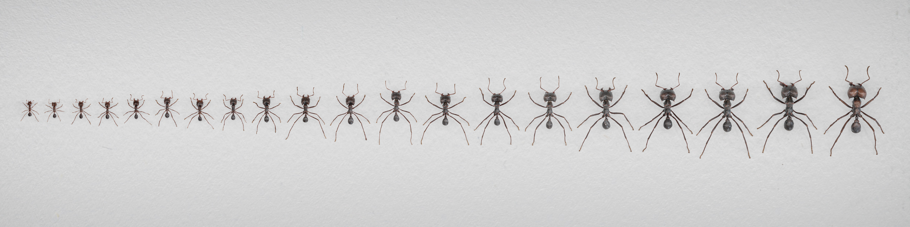

# WOLO
**Wilson Only Looks Once** - official GitHub repo, containing data parsing and generation files, links to all used datasets and training as well as evaluation routines.

by [Fabian **Plum**](https://twitter.com/fabian_plum) and [David **Labonte**](https://twitter.com/EvoBiomech)

___

_rendered image of synthetic leafcutter ant colony, digitised using [scAnt](https://github.com/evo-biomech/scAnt), rigged and rendered in [Blender](https://www.blender.org/), synthetic datasets generated with [replicAnt](https://github.com/evo-biomech/replicAnt) in [Unreal Engine](https://www.unrealengine.com/en-US)_

___

# Project Description

This repo and page are a work in progress and will be continuously updated as Fabi attempts to submit his PhD thesis by the end of the year.
___

### References

When using **WOLO** datasets and models or our other projects in your work, please make sure to cite them:

    @article{PlumLabonte2021,
        title = {scAnt — An open-source platform for the creation of 3D models of arthropods (and other small objects)},
        author = {Plum, Fabian and Labonte, David},
        doi = {10.7717/peerj.11155},
        issn = {21678359},
        journal = {PeerJ},
        keywords = {3D,Digitisation,Macro imaging,Morphometry,Photogrammetry,Zoology},
        volume = {9},
        year = {2021}
        }
    
    @misc{Plum2022,
        title = {OmniTrax},
        author = {Plum, Fabian},
        resource = {GitHub repository},
        howpublished = {https://github.com/FabianPlum/OmniTrax},
        year = {2022}
        }

    @misc{Plumetal2023,
        author = {Fabian Plum and Rene Bulla and Hendrik Beck and Natalie Imirzian and David Labonte},
        title = {replicAnt - generating annotated images of animals in complex environments with Unreal Engine},
        elocation-id = {2023.04.20.537685},
        year = {2023},
        doi = {10.1101/2023.04.20.537685},
        publisher = {Cold Spring Harbor Laboratory},
        URL = {https://www.biorxiv.org/content/early/2023/04/20/2023.04.20.537685},
        journal = {bioRxiv}
        }

## Contributing
Pull requests are warmly welcome. For major changes, please open an issue first to discuss what you would like to change.

## License
© Fabian Plum, David Labonte 2023
[MIT License](https://choosealicense.com/licenses/mit/)
