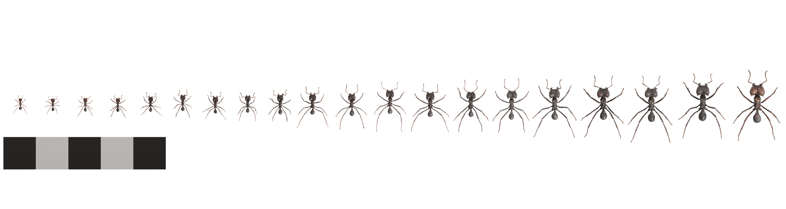
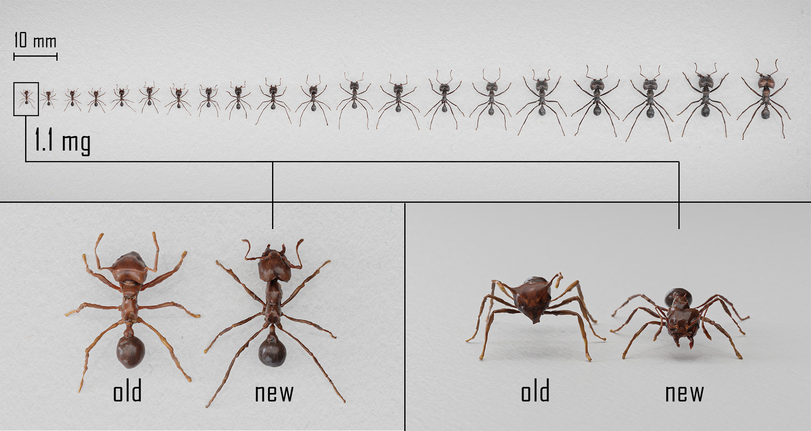

# WOLO
**Wilson Only Looks Once** - official GitHub repo, containing data parsing and generation files, links to all used datasets and training as well as evaluation routines.

by [Fabian Plum](https://fabianplum.com/) & [David Labonte](https://twitter.com/EvoBiomech)

___

_rendered image of synthetic leafcutter ant colony, digitised using [scAnt](https://github.com/evo-biomech/scAnt), rigged and rendered in [Blender](https://www.blender.org/), synthetic datasets generated with [replicAnt](https://github.com/evo-biomech/replicAnt) in [Unreal Engine](https://www.unrealengine.com/en-US)_

___

# Project Description

This repo and page are a work in progress and will be continuously updated as Fabi attempts to submit his PhD thesis by the end of the year.

WOLO data can then be integrated with OmniTrax estimates for combined tracking / pose / size estimation:

___

# Example synthetic images

Generated from 3D models of specimens digitised with the latest build of [scAnt](https://github.com/evo-biomech/scAnt).

### _Atta vollenweideri_ - 20 weight class dataset:

The following samples are part of the datasets used to train detection, regressor, and classifier networks, and
have been generated with [***replicAnt* - generating annotated images of animals in complex environments with Unreal
Engine**](https://www.biorxiv.org/content/10.1101/2023.04.20.537685v1).

<table style="padding:10px">
  <tr> 
   <td></td>
   <td></td>
   <td></td>
  </tr>
  <tr> 
   <td></td>
   <td></td>
   <td></td>
  </tr>
  <tr> 
   <td></td>
   <td></td>
   <td></td>
  </tr>
</table>

### 3D models and datasets
- 3D Models [10.5281/zenodo.11167946](https://zenodo.org/records/11167946)
- Datasets [10.5281/zenodo.11167521](https://zenodo.org/records/11167521)

### References

When using **WOLO** datasets and models or our other projects in your work, please make sure to cite them:

    @article{PlumLabonte2021,
        title = {scAnt — An open-source platform for the creation of 3D models of arthropods (and other small objects)},
        author = {Plum, Fabian and Labonte, David},
        doi = {10.7717/peerj.11155},
        issn = {21678359},
        journal = {PeerJ},
        keywords = {3D,Digitisation,Macro imaging,Morphometry,Photogrammetry,Zoology},
        volume = {9},
        year = {2021}
        }
    
    @article{Plum2024, 
        title = {OmniTrax: A deep learning-driven multi-animal tracking and pose-estimation add-on for Blender},
        doi = {10.21105/joss.05549}, 
        url = {https://doi.org/10.21105/joss.05549},
        year = {2024}, publisher = {The Open Journal}, 
        volume = {9}, number = {95}, pages = {5549}, 
        author = {Fabian Plum},  
        journal = {Journal of Open Source Software} 
    }

    @article{Plum2023a,
        title = {replicAnt: a pipeline for generating annotated images of animals in complex environments using Unreal Engine},
        author = {Plum, Fabian and Bulla, René and Beck, Hendrik K and Imirzian, Natalie and Labonte, David},
        doi = {10.1038/s41467-023-42898-9},
        issn = {2041-1723},
        journal = {Nature Communications},
        url = {https://doi.org/10.1038/s41467-023-42898-9},
        volume = {14},
        year = {2023}
        }

## Contributing
Pull requests are warmly welcome. For major changes, please open an issue first to discuss what you would like to change.

## License
© Fabian Plum, David Labonte 2023
[MIT License](https://choosealicense.com/licenses/mit/)
